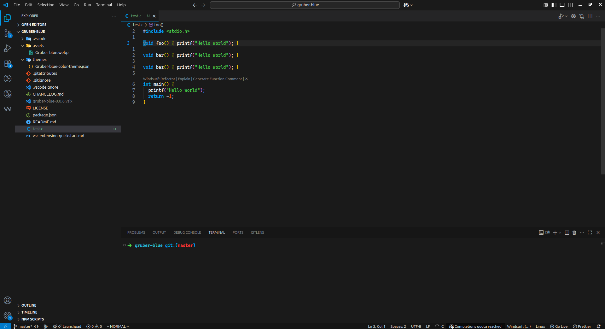
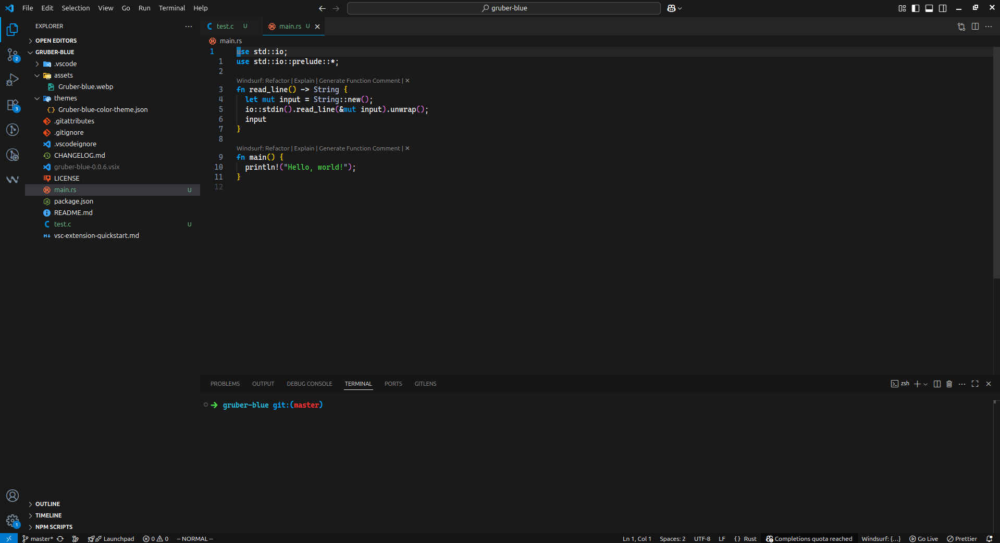
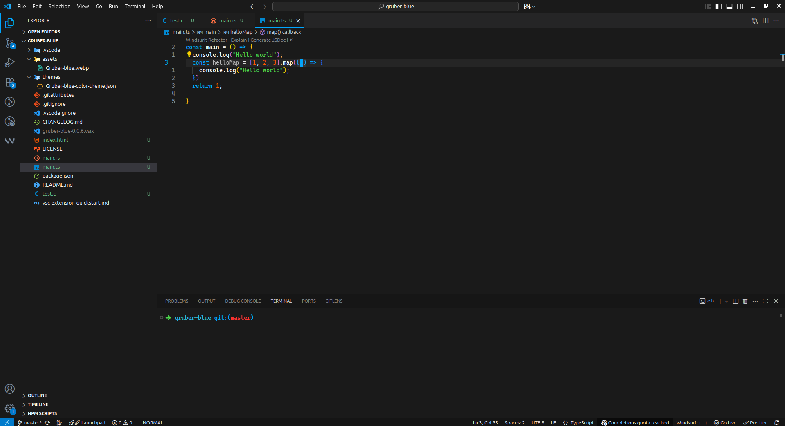
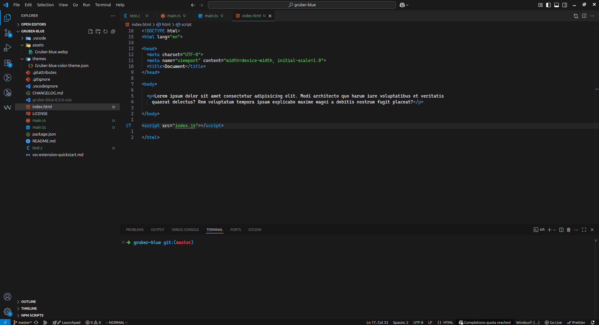

# Tsoding Gruber Blue — Custom Theme

A clean **blue-tinted variant** of the original _Tsoding Emacs Gruber_ theme.

This theme keeps the same cozy, contrast-rich aesthetic of Gruber, but introduces a cool blue palette for a calmer, more modern look.

It’s designed to be easy on the eyes, especially during long coding sessions.

> **Recommended font:** _Caskaydia Mono Nerd Font_ for the best visual consistency and icon support.

---

## 🎨 Screenshots

### Syntax Highlighting

---

## 📦 Installation

Install the theme from your editor's extension marketplace or manually clone the repository.

---

## ⚙️ Usage

After installation, select the theme:

- **VS Code:** `Preferences → Color Theme → Tsoding Gruber Blue`
- **Emacs (if using port):** load using your theme loader

---

## 🤝 Contributing

Feel free to open issues or submit PRs for improvements.

---

## 📜 License

MIT
